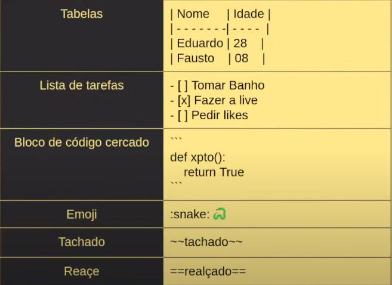

# Bem vindo ao MkDocs

Esta documentação visa uma introdução básica ao MkDocs.

A documentação completa se encontra em [mkdocs.org](https://www.mkdocs.org).

## Instalação
sudo apt install mkdocs

Obs:
Para outros sistemas que não sejam baseados em Debian,
por favor vide a documentação acima.


## Comandos principais

* `mkdocs new [dir-name]` - Create a new project.
* `mkdocs serve` - Inicie o servidor de documentos de recarga ao vivo..
* `mkdocs build` - Construir o site de documentação.
* `mkdocs -h` - Imprimir mensagem de ajuda e sair.
* `gh-deploy` - Implante sua documentação no GitHub Pages


## Layout do projeto

    mkdocs.yml    # O arquivo de configuração. docs/
    docs/
        index.md  # A página inicial da documentação.
        ...       # Outras páginas de remarcação, imagens e outros arquivos.
        
## Mark Down Padrão
Mkdocs usa o Mark Down.
É uma linhagem de marcação(markup language) para criação de textos,
formatados em editores de texto simples.

Em 2009 o GitHub markdown como linguagem com algumas variações.

Em 2012 foram criados 2 padrões RFC 7763 / RFC 7763 para que o markdown fosse 
aceito como um padrão da internet.

Em 2018 o PyPi começou a aceitar MarkDown nas descrições de bibliotecas.

## Cabeçalho
`# Título`* `## Subtítulo`* `### h3`

## Negrito
`***negrito***`
***Negrito***

## Itálico
`*itálico*`
`Itálico`

## Citação
`> Que seja feita a luz`

## Lista ordena
`1. Primeiro`
`2. Segundo`
1. Primeiro
2. Segundo

## Lista não ordenada
`- item A - item B`

- item A
- item B

## Código

`res = 1 if a=1 else 0 `

## Links 

`[DuckDuckGo](https://ddg.gg)`

[DuckDuckGo](https://ddg.gg)

## Imagens

``


# MarkDown Extendido
Para funcionar adequadamente instale:
```pip install pymdown-extensions```

Após instalar , vá no arquivo de configuração```ḿkdocs.yml``` e adicione:
```
markdown_extensions:
 - pymdownx.tasklist  #Suporte a lista de tarefas
 - pymdownx.emoji     #Suporte a Emojis
 - pymdownx.mark      #Suporte a Tachado
 - pymdownx.tilde     #Suporte a Realçado
```

## Comandos


## Tabela

| Nome | Idade |
| ---- | ----- |
| Eduardo | 23 |
| João | 25 |
| Tiago | 30 |

## Lista de tarefas

- [ ] Pão
- [X] Leite
- [ ] Manteiga

## Bloco de código

```
def com_sorte():
    """Docstring"""
    return True
```

## Emoji
Emoji - :snake: :heart: :rocket:

## Tachado
~~tachado~~

## Realçado
==realçado==


