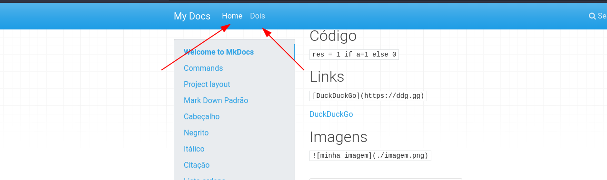
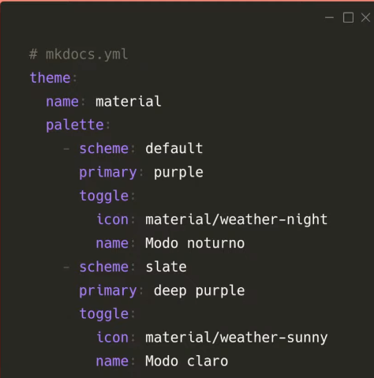
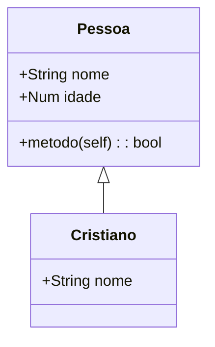
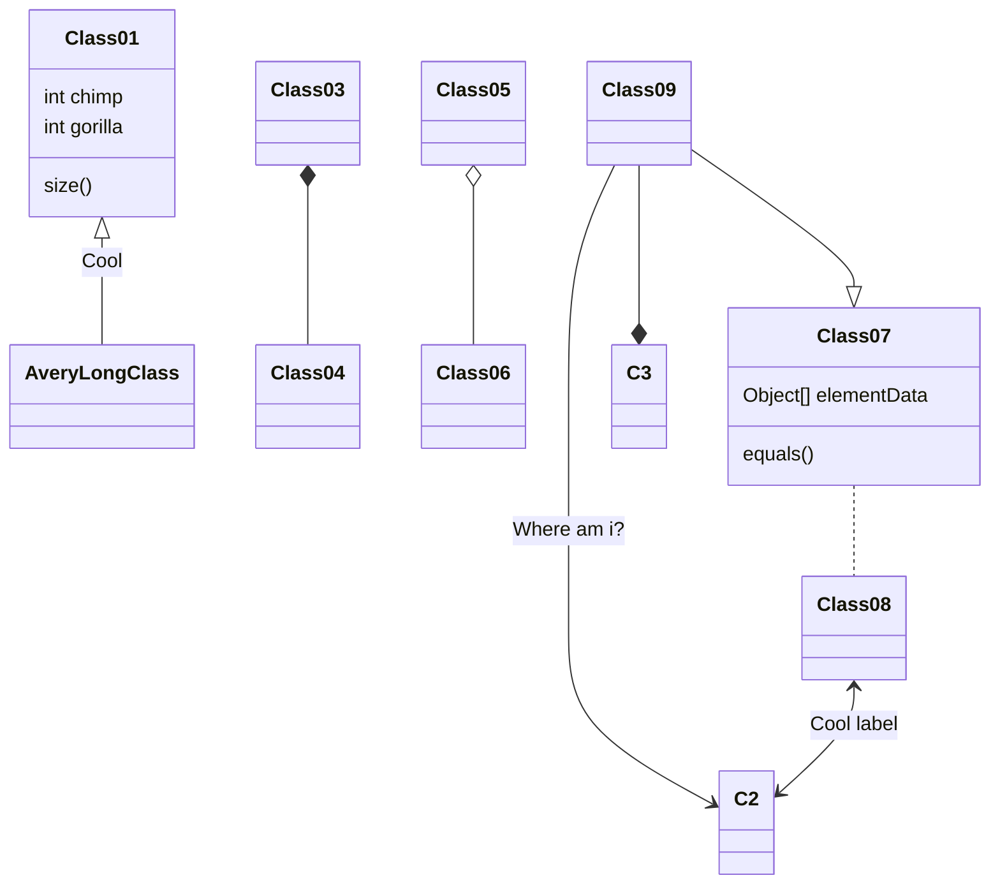

# Extrutura e extensões
## Para criar uma outra página
Na pastas docs, crie um outro arquivo com o nome que vc quiser com a extensão.md

Para oranizar as páginas na Nave Bar, no arquivo de configuração(mkdocs.yml) use:
```
nav:
   - Home: index.md
   - Dois: pagina2.md
   - Pagina2: outros/pagina3.md
```

## Temas
Por padrão, o mkDocs disponibiliza dois temas. M mkdocs e o tema do readthedocs.
A alteração pode ser feita no mkdocs.yaml usando a chave `theme`
Muitos ao redor do mundo tem uisado mais o mkdocs-material que tem se tornado padrão
na maioria dos projetos de grande porte:
```pip install mkdocs-material```
```
theme:
    name: readthedocs  # ou mkdocsk
```
## Palheta de cores
Mais configurações do Material: [Aqui](https://squidfunk.github.io/mkdocs-material/setup/changing-the-colors/?h=color#configuration)



Outros temas : [Aqui](https://github.com/mkdocs/mkdocs/wiki/MkDocs-Themes)


# Superfances
Possibilita muitas opções interessantes [Aqui](https://facelessuser.github.io/pymdown-extensions/extensions/superfences/)
Para habilitar o superfences, é preciso habiliat colocar duas linhas a mais no arquivo mkdocs:
```
markdown_extensions:
 - pymdownx.highlight #Suporte a Código
 - pymdownx.superfences
```

```{.py3 hl_lines="1-3" linenums="10" title="Exemplo"}
def com_sorte():
    """Docstring"""
    return True
```

# Superfence pernonalizadas - Mermaid
Possibilita criar diagramas [Aqui](https://facelessuser.github.io/pymdown-extensions/extensions/superfences/)
É possivel adicoonar css e javascript customizado na sua documentação no arquivo mkdocs.yml.
Exemplo de superfence do mermaind.js
```
 - pymdownx.superfences:
    custom_fences:
      - name: mermaid
        class: mermaid
        format: !!python/name:pymdownx.superfences.fence_div_format
extra_css:
  - https://unpkg.com/mermaid@8.5.1/dist/mermaid.css
extra_javascript:
  - https://unpkg.com/mermaid@8.5.1/dist/mermaid.min.js
```
### Exemplos mermaid.js


Flowchart




Mais opções: [Aqui](https://mermaid-js.github.io/mermaid/#/)